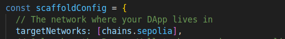

# 🏗Aura dApp

<h4 align="center">
  <a href="https://aura-web-dapp.vercel.app/">Website</a> |
  <a href="">Demo</a>
</h4>

# 🌈 Aura dApp – Purposeful Habits with On-Chain Proof
**This is an open source project — contributions are welcome!**

**Aura** is a wellness-focused dApp that helps you build spiritual and biohacking habits. It allows users to create a custom habit, stick to it for 7 consecutive days, and receive an **Aura NFT** as a proof of achievement — minted on the blockchain.

This MVP was built as a simple, frictionless Web3 experience designed for **non-crypto users**.  
**✨ 80% of the design and development was assisted by Artificial Intelligence.**

---

## 🚀 What does Aura do?

1. Lets you create a personalized habit (e.g., “meditate 10 min”, “no sugar”, “express gratitude”).
2. Tracks your daily progress for 7 days.
3. Mints an **Aura NFT** as proof of commitment.
4. Uses **Google OAuth** and Chipi Pay SDK to generate a Web3 wallet with zero friction.
5. Visualizes progress using Supabase and unlocks premium habits via **Stripe**.

---

## 🛠️ Technologies Used

- **Frontend**: Next.js + Tailwind + Shadcn
- **Auth + Wallet**: Chipi Pay SDK (Google login)
- **Backend**: Supabase (auth, database, storage)
- **Smart Contracts**: Cairo on Starknet (testnet mint → automatic mainnet mint)
- **Infrastructure**: Vercel + Supabase + Stripe

---

## 💡 Why Aura?

Aura was born from a personal need to track life-changing habits and visually celebrate discipline.  
Each Aura NFT is a **spiritual digital trophy** — only minted if you stay true to your commitment.

Your wallet becomes a **gallery of integrity and growth**, not just a place for assets.

---

## 🌱 Key Features

- ✅ Frictionless login with Google
- ✅ Web3 wallet generated automatically
- ✅ Custom habit creation with name and icon
- ✅ Daily habit tracking for 7 days
- ✅ NFT minting upon successful completion
- ✅ Stripe integration to unlock additional habits

---

## ⚙️ System Architecture
[ Next.js ] → [ Chipi Pay SDK ] → [ Supabase (DB + Auth) ] ↓ [ Cairo Smart Contract – Aura NFT ] ↓ [ Mint on Starknet Testnet ] → [ Transparent Mint on Mainnet ] ↓ [ Stripe – Unlock premium habits ]


---

## 🤖 Role of Artificial Intelligence

Aura was built by a human-led team, heavily assisted by AI tools:

- **ChatGPT**: System logic, UI flows, writing, architecture
- **Copilot**: Backend/frontend code support
- **Midjourney / DALL·E**: Aura visuals and illustrations
- **Notion AI / Claude**: Ideation, flow design, and documentation

Thanks to these tools, Aura was built in record time with a focused vision.

---

## 📌 MVP Status

✅ Functional MVP  
🔄 Testnet Active  
🔜 Mainnet Minting in Progress  
💳 Stripe Payments Integrated  
🧪 Validating with first 100 users

---

## 👥 Target Audience

- Wellness seekers, spiritual explorers, and habit builders.
- Newcomers to Web3 who want a simple experience.
- Users looking for visual, gamified motivation systems.

---

## 🤝 Contributing

Aura is an open source project, and contributions are more than welcome!

If you’d like to fix a bug, suggest a feature, improve the UX, or help with smart contracts — feel free to fork this repo and submit a pull request.

We’re especially excited to collaborate with:

- Developers passionate about wellness and Web3
- Designers who want to improve the user experience
- Builders who believe in creating meaningful digital experiences

Let’s build the future of intentional habits together 💫


## 📬 Contact

Interested in trying it, collaborating, or learning more?

**Ricardo Mazuera** – Creator & Developer  
📧 ricardo.mazuera@gmail.com  
🐦 [@ricardomazuera_](https://x.com/ricardomazuera_)
🌐 [ricardomazuera.com](https://ricardomazuera.com)

---

> “Build habits with intention. Seal them on the blockchain. That’s the mission of Aura.”


## Requirements

Before you begin, you need to install the following tools:

- [Node (>= v18.17)](https://nodejs.org/en/download/)
- Yarn ([v1](https://classic.yarnpkg.com/en/docs/install/) or [v2+](https://yarnpkg.com/getting-started/install))
- [Git](https://git-scm.com/downloads)
- [Rust](https://rust-lang.org/tools/install)
- [asdf](https://asdf-vm.com/guide/getting-started.html)
- [Cairo 1.0 extension for VSCode](https://marketplace.visualstudio.com/items?itemName=starkware.cairo1)

### Starknet-devnet version

To ensure the proper functioning of scaffold-stark, your local `starknet-devnet` version must be `0.2.4`. To accomplish this, first check your local starknet-devnet version:

```sh
starknet-devnet --version
```

If your local starknet-devnet version is not `0.2.4`, you need to install it.

- Install Starknet-devnet `0.2.4` via `asdf` ([instructions](https://github.com/gianalarcon/asdf-starknet-devnet/blob/main/README.md)).

### Scarb version

To ensure the proper functioning of scaffold-stark, your local `Scarb` version must be `2.9.4`. To accomplish this, first check your local Scarb version:

```sh
scarb --version
```

If your local Scarb version is not `2.9.4`, you need to install it.

- Install Scarb `2.9.4` via `asdf` ([instructions](https://docs.swmansion.com/scarb/download.html#install-via-asdf)).

### Starknet Foundry version

To ensure the proper functioning of the tests on scaffold-stark, your Starknet Foundry version must be 0.38.2. To accomplish this, first check your Starknet Foundry version:

```sh
snforge --version
```

If your Starknet Foundry version is not `0.38.2`, you need to install it.

- Install Starknet Foundry `0.38.2` via `asdf` ([instructions](https://foundry-rs.github.io/starknet-foundry/getting-started/installation.html#installation-via-asdf)).

## Compatible versions

- Starknet-devnet - v0.2.4
- Scarb - v2.9.4
- Snforge - v0.38.2
- Cairo - v2.9.4
- Rpc - v0.7.1

## Requirements (Alternative Option with Docker)

As an alternative to installing the tools locally, you can use Docker. Here's what you need to do:

1. Install [Docker](https://www.docker.com/get-started/)
2. Install [Dev Containers](https://marketplace.visualstudio.com/items?itemName=ms-vscode-remote.remote-containers)
3. Use the provided `devcontainer.json` file to set up the environment:
   - The configuration uses the `starknetfoundation/starknet-dev:2.9.2` image.
   - This includes all required tools pre-installed, such as Scarb, Starknet Foundry, Starknet Devnet and other dependencies.

### Getting Started with Docker Setup

To start using the Docker-based setup:

1. Open the project in **Visual Studio Code**.
2. Select **"Reopen in Container"**.
3. If you need to rebuild the container, open the Command Palette (**View -> Command Palette**) and choose:
   - **Dev Containers: Rebuild and Reopen in Container**

> Once inside the container, you can start working with all the tools and dependencies pre-configured.

## Quickstart with Starknet-Devnet

To get started with Scaffold-Stark, follow the steps below:

1. Clone this repo and install dependencies

```bash
git clone https://github.com/Scaffold-Stark/scaffold-stark-2.git
cd scaffold-stark-2
yarn install
```

2. Run a local network in the first terminal.

```bash
yarn chain
```

> To run a fork : `yarn chain --fork-network <URL> [--fork-block <BLOCK_NUMBER>]`

This command starts a local Starknet network using Devnet. The network runs on your local machine and can be used for testing and development. You can customize the network configuration in `scaffold.config.ts` for your nextjs app.

3. On a second terminal, deploy the sample contract:

```bash
yarn deploy
```

This command deploys a sample smart contract to the local network. The contract is located in `packages/snfoundry/contracts/src` and can be modified to suit your needs. The `yarn deploy` command uses the deploy script located in `packages/snfoundry/scripts-ts/deploy.ts` to deploy the contract to the network. You can also customize the deploy script.

By default `Scaffold-Stark` takes the first prefunded account from `starknet-devnet` as a deployer address,

4. On a third terminal, start your NextJS app:

```bash
yarn start
```

Visit your app on: `http://localhost:3000`. You can interact with your smart contract using the `Debug Contracts` page. You can tweak the app config in `packages/nextjs/scaffold.config.ts`.

5. Check your environment variables. We have a yarn postinstall script that helps to fill in your environment variables. If the environment variable does not exist, you can fill them it manually to get the app running!

## Quickstart with Sepolia Testnet

<details>

1. Make sure you already cloned this repo and installed dependencies.

2. Prepare your environment variables.

Find the `packages/snfoundry/.env` file and fill the env variables related to Sepolia testnet with your own wallet account contract address and private key.

3. Change your default network to Sepolia testnet.

Find the `packages/nextjs/scaffold.config.ts` file and change the `targetNetworks` to `[chains.sepolia]`.



4. Get some testnet tokens.

You will need to get some `ETH` or `STRK` Sepolia tokens to deploy your contract to Sepolia testnet.

> Some popular faucets are [Starknet Faucet](https://starknet-faucet.vercel.app/) and [Blastapi Starknet Sepolia Eth](https://blastapi.io/faucets/starknet-sepolia-eth)

4. Open a terminal, deploy the sample contract to Sepolia testnet:

```bash
yarn deploy --network sepolia
```

5. On a second terminal, start your NextJS app:

```bash
yarn start
```

Visit your app on: `http://localhost:3000`. You can interact with your smart contract using the `Debug Contracts` page. You can tweak the app config in `packages/nextjs/scaffold.config.ts`.

### RPC specific version

To ensure the proper functioning of the scaffold-stark with Testnet or Mainnet, your RPC version must be `0.7.1`. This repository contains a `.env.example` file, where we provided the default RPC URL for the Starknet Testnet: `RPC_URL_SEPOLIA=https://starknet-sepolia.public.blastapi.io/rpc/v0_7`. Let's verify this RPC version is `0.7.1` by calling a `POST` request in an API platform like `Postman` or `Insommia` . Your API endpoint should be `https://starknet-sepolia.public.blastapi.io/rpc/v0_7` and the body should be:

```json
{
 "jsonrpc":"2.0",
 "method":"starknet_specVersion",
 "id":1
}
```

You have to paste the endpoint and body in the API platform and click on the `Send` button. If the response is `0.7.1`, then you are good to go. Otherwise, you have to get the correct RPC URL endpoint.


</details>

## Network Configuration Centralization

We've streamlined RPC provider configuration by centralizing network settings in `scaffold.config.ts`. All RPC URLs are now defined in the `rpcProviderUrl` object, and functions reference this centralized configuration instead of using environment variables directly.

**How to Change Networks:**

- Update the `targetNetworks` array in `scaffold.config.ts`.
- The first network in this array is used as the primary target.
- Ensure each network has a corresponding RPC URL specified in the `rpcProviderUrl` object.

### Required Environment Variables

For the network configuration to work correctly, you must set the following environment variables in your `.env` file:

- `NEXT_PUBLIC_DEVNET_PROVIDER_URL`
- `NEXT_PUBLIC_SEPOLIA_PROVIDER_URL`
- `NEXT_PUBLIC_MAINNET_PROVIDER_URL`

These variables are used in the configuration to assign the correct RPC URLs:

```typescript
"devnet": process.env.NEXT_PUBLIC_DEVNET_PROVIDER_URL || process.env.NEXT_PUBLIC_PROVIDER_URL || "",
"sepolia": process.env.NEXT_PUBLIC_SEPOLIA_PROVIDER_URL || process.env.NEXT_PUBLIC_PROVIDER_URL || "",
"mainnet": process.env.NEXT_PUBLIC_MAINNET_PROVIDER_URL || process.env.NEXT_PUBLIC_PROVIDER_URL || ""
```

### RPC specific version

To ensure the proper functioning of Scaffold-Stark with Testnet or Mainnet, your RPC version must be `0.7.1`. This repository contains a `.env.example` file with the default RPC URL for Starknet Testnet:

## CLI Usage

Depending on your package manager, substitute the work COMMAND with the appropiate one from the list.

   $ yarn COMMAND
   $ npm run COMMAND

Commands:

| Command          | Description                                                                               |
| ---------------- | ----------------------------------------------------------------------------------------- |
| format:check     | (Read only) Batch checks for format inconsistencies for the nextjs and snfoundry codebase |
| next:check-types | Compile  typscript project                                                                |
| next:lint        | Runs next lint                                                                            |
| prepare          | Install husky's git hooks                                                                 |
| usage            | Show this text                                                                            |

### CLI Smart Contracts

| Command         | Description                                                                         |
| --------------- | ----------------------------------------------------------------------------------- |
| compile         | Compiles contracts.                                                                 |
| test            | Runs snfoundry tests                                                                |
| chain           | Starts the local blockchain network.                                                |
| deploy          | Deploys contract to the configured network discarding previous deployments.         |
| deploy:no-reset | Deploys contract to the configured network without discarding previous deployments. |
| verify          | Verify Smart Contracts with Walnut                                                  |

### CLI Frontend

| Command     | Description                                  |
| ----------- | -------------------------------------------- |
| start       | Starts the frontend server                   |
| test:nextjs | Runs the nextjs tests                        |
| vercel      | Deploys app to vercel                        |
| vercel:yolo | Force deploy app to vercel (ignoring errors) |


## **What's next**

- Edit your smart contract `YourContract.cairo` in `packages/snfoundry/contracts/src`
- Edit your frontend homepage at `packages/nextjs/app/page.tsx`. For guidance on [routing](https://nextjs.org/docs/app/building-your-application/routing/defining-routes) and configuring [pages/layouts](https://nextjs.org/docs/app/building-your-application/routing/pages-and-layouts) checkout the Next.js documentation.
- Edit your deployment scripts in `packages/snfoundry/script-ts/deploy.ts`
- Edit your smart contract tests in `packages/snfoundry/contracts/src/test`. To run tests use `yarn test`
- You can write unit tests for your Next.js app! Run them with one the following scripts below.
  - `yarn test:nextjs` to run regular tests with watch mode
  - `yarn test:nextjs run` to run regular tests without watch mode
  - `yarn test:nextjs run --coverage` to run regular tests without watch mode with coverage

## Documentation

Visit our [docs](https://docs.scaffoldstark.com/) to learn how to start building with Scaffold-Stark.

To know more about its features, check out our [website](https://scaffoldstark.com)

#### External Image Source Configuration

In the `next.config.mjs`, we've set up external image sources using `remotePatterns` to allow fetching assets from specific domains. This is particularly useful for loading images or assets from external servers or services.

```javascript
remotePatterns: [
  // External image source for StarkNet ID identicons
  {
    protocol: "https",
    hostname: "identicon.starknet.id",
    pathname: "/**", // Allows all paths under this domain
  },
  // External image source for images hosted on Starkurabu
  {
    protocol: "https",
    hostname: "img.starkurabu.com",
    pathname: "/**",
  },
],
```

## Contributing to Scaffold-Stark

We welcome contributions to Scaffold-Stark!

Please see [CONTRIBUTING.MD](https://github.com/Scaffold-Stark/scaffold-stark-2/blob/main/CONTRIBUTING.md) for more information and guidelines for contributing to Scaffold-Stark.
